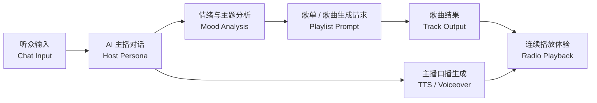
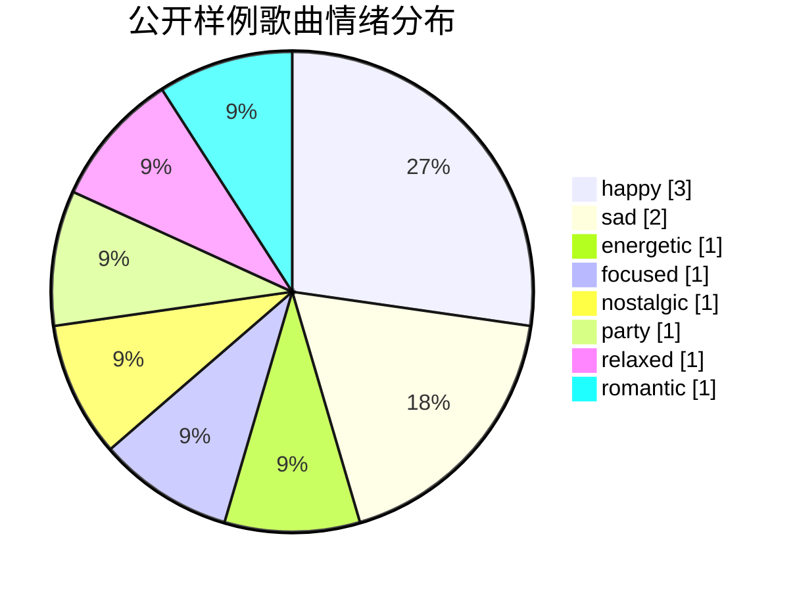
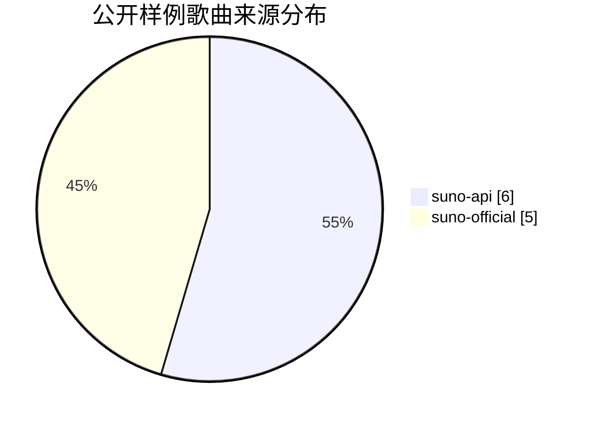

<table>
  <tr>
    <td><strong>简体中文</strong></td>
    <td><a href="./README.en.md">English</a></td>
  </tr>
</table>

# AI Radio Station

> 一个把 AI 主播、情绪理解、歌曲生成、歌单编排和陪伴式播放串起来的实验性电台项目。

[](https://nextjs.org/)
[](https://react.dev/)
[](https://fastify.dev/)
[](https://www.typescriptlang.org/)
[](./LICENSE)

## 项目简介

AI Radio Station 是一个以源码为核心的 AI 电台实验项目。它把“和主播聊天”、“理解情绪”、“生成歌曲或歌单提示词”、“播放歌曲”、“穿插主播口播”这些环节连成一个完整体验，适合用来研究 AI 陪伴、AI 媒体和交互式音频产品。

这个公开版本已经做过开源清理：

- 不包含真实 API Key、Cookie、Session Token 或抓包请求
- 不包含私有快照、敏感日志和未脱敏凭据
- 第三方真实接入需要在你自己的本地环境中配置

## 内容账号

<table>
  <tr>
    <td align="center">
      <a href="https://space.bilibili.com/19424585" target="_blank" rel="noreferrer" aria-label="Bilibili">
        
      </a>
    </td>
    <td align="center">
      <a href="https://www.xiaohongshu.com/user/profile/69b3ac44000000003303a46d" target="_blank" rel="noreferrer" aria-label="小红书">
        
      </a>
    </td>
    <td align="center">
      <a href="https://www.douyin.com/user/MS4wLjABAAAAVxOLXVqE-xyf0YJzVA3gRzegUEb2R-yUOYrVtK0bBSmrMEOHvKxeuVty4k3neDSJ" target="_blank" rel="noreferrer" aria-label="抖音">
        
      </a>
    </td>
  </tr>
  <tr>
    <td align="center">Bilibili</td>
    <td align="center">小红书</td>
    <td align="center">抖音</td>
  </tr>
</table>

## 工作流



## 亮点速览

| 模块 | 能力 |
| --- | --- |
| `Chat Host` | 和 AI 主播对话，接住情绪和场景 |
| `Mood Engine` | 从对话中提炼心情、主题和音乐方向 |
| `Playlist Builder` | 生成歌单请求，管理播放顺序与上下文 |
| `Song Playback` | 播放歌曲、本地音频和生成素材 |
| `Voiceover` | 在歌曲前后插入主播口播、过门和陪伴话术 |
| `Provider Switch` | 可按需接入 DeepSeek、OpenAI 兼容接口、MiniMax、ByteDance、Suno |

## 当前公开样例

这份公开仓库当前已经整理出一套可直接查看的样例资源：

- `11` 首已去重的完整歌曲
- `8` 种情绪标签
- `2` 类歌曲来源：`suno-api` 与 `suno-official`
- 约 `51 MB` 的公开音频样例

可直接查看：

- [公开歌曲清单 CSV](./data/playable-songs.csv)
- [公开歌曲清单 JSON](./data/playable-songs.json)
- [公开样例数据库](./data/radio.sqlite)
- [音频目录](./audio/generated)

### 情绪分布图



### 来源分布图



## 谁适合使用

- 想探索 AI 电台、AI 陪伴、AI 媒体产品形态的开发者
- 想参考一个 Next.js + Fastify 小型全栈项目结构的团队
- 想基于自己的凭据研究 Suno 私有工作流和音乐生成体验的实验者

## 项目结构

```text
ai-radio-station/
├── apps/
│   ├── api/              # Fastify 后端
│   └── web/              # Next.js 前端
├── audio/
│   └── generated/        # 公开样例音频
├── data/
│   ├── playable-songs.csv
│   ├── playable-songs.json
│   ├── radio.sqlite
│   ├── demo-chat-history.example.json
│   └── manual-generate-request.example.json
├── .env.example
└── package.json
```

## 技术栈

- 前端：Next.js 15、React 19、TypeScript
- 后端：Fastify 5、Node.js ESM
- 可选 LLM：DeepSeek、OpenAI 兼容接口、MiniMax
- 可选 TTS：MiniMax、ByteDance OpenSpeech、Edge
- 可选音乐生成：基于用户自备本地模板的 Suno 直连流程

## 快速开始

### 1. 安装依赖

```bash
npm install
```

### 2. 创建本地环境变量

```bash
cp .env.example .env
```

默认模板适合安全的本地开发，不包含任何真实密钥。

### 3. 启动后端

```bash
npm run dev:api
```

### 4. 启动前端

在第二个终端中执行：

```bash
npm run dev:web
```

### 5. 打开应用

访问 [http://localhost:3000](http://localhost:3000)。

## 配置模式

### 最小本地模式

推荐第一次运行时使用：

- 保持 `AI_LLM_PROVIDER=deepseek`
- 保持 `AI_TTS_PROVIDER=mock`
- 保持 `SUNO_ENABLE_REAL=false`

这样可以在不暴露任何私有凭据的前提下先把项目完整跑起来。

### 真实 LLM 对话

DeepSeek：

```env
AI_LLM_PROVIDER=deepseek
DEEPSEEK_API_KEY=your_key_here
```

OpenAI 兼容接口：

```env
AI_LLM_PROVIDER=openai
OPENAI_API_KEY=your_key_here
OPENAI_CHAT_BASE_URL=https://api.openai.com
OPENAI_MODEL=gpt-4o-mini
```

MiniMax：

```env
AI_LLM_PROVIDER=minimax
MINIMAX_API_KEY=your_key_here
MINIMAX_CHAT_BASE_URL=https://api.minimaxi.com
MINIMAX_CHAT_MODEL=MiniMax-M2.7
```

### 真实主播 TTS

MiniMax：

```env
AI_TTS_PROVIDER=minimax
MINIMAX_API_KEY=your_key_here
MINIMAX_TTS_BASE_URL=https://api.minimaxi.com
MINIMAX_TTS_MODEL=speech-2.8-hd
```

ByteDance / OpenSpeech：

```env
AI_TTS_PROVIDER=bytedance
BYTEDANCE_TTS_API_KEY=your_key_here
BYTEDANCE_TTS_RESOURCE_ID=seed-tts-2.0
```

### 真实 Suno 生成

仓库本身不包含可复用的 Suno token、cookie、browser token 或抓包结果。

如果你想在本地启用真实 Suno：

1. 在 `.env` 中设置 `SUNO_ENABLE_REAL=true`
2. 将 [data/manual-generate-request.example.json](./data/manual-generate-request.example.json) 复制为 `data/manual-generate-request.json`
3. 填入你自己的最新有效请求值
4. 如有需要，再通过环境变量覆盖 `SUNO_AUTHORIZATION`、`SUNO_BROWSER_TOKEN`、`SUNO_SESSION_TOKEN` 等字段

## 示例文件

- [data/demo-chat-history.example.json](./data/demo-chat-history.example.json)：安全的对话请求示例
- [data/manual-generate-request.example.json](./data/manual-generate-request.example.json)：已经脱敏的 Suno 本地模板结构

## API 接口

| 接口 | 方法 | 用途 |
| --- | --- | --- |
| `/health` | GET | 健康检查 |
| `/api/chat` | POST | 与主播对话 |
| `/api/chat/analyze` | POST | 分析情绪与音乐方向 |
| `/api/playlist/from-chat` | POST | 根据聊天分析并生成歌单请求 |
| `/api/playlist/generate` | POST | 生成歌单 |
| `/api/playlist/current` | GET | 获取当前内存中的歌单 |
| `/api/host/voice` | POST | 生成主播口播音频 |
| `/api/audio/music/:trackId` | GET | 播放歌曲音频 |
| `/api/audio/generated/:filename` | GET | 播放本地生成音频 |

## 发布说明

如果你准备把这个项目发布为新的公开仓库，建议基于当前这份已清理工作树重新建仓，而不是直接暴露旧的本地 Git 历史，以避免历史提交中残留私有产物。

## License

MIT
