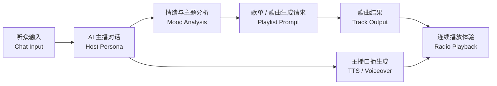

<table>
  <tr>
    <td><a href="./README.en.md">English</a></td>
    <td><strong>简体中文</strong></td>
  </tr>
</table>

# AI Radio Station

AI Radio Station 是一个以源码为核心的 AI 电台实验项目：与主播人设聊天、分析对话情绪、生成歌曲与歌单提示词，并为电台场景合成简短主播口播。

这个公开版本已经按开源要求做过清理：

- 不包含真实 API Key、Cookie、Session Token 或抓包请求
- 不包含生成音频、本地数据库或私有快照
- 所有第三方真实接入都需要你在本地自行配置

## 内容账号

<table>
  <tr>
    <td align="center">
      <a href="https://space.bilibili.com/19424585" target="_blank" rel="noreferrer" aria-label="Bilibili">
        
      </a>
    </td>
    <td align="center">
      <a href="https://www.xiaohongshu.com/user/profile/69b3ac44000000003303a46d" target="_blank" rel="noreferrer" aria-label="小红书">
        
      </a>
    </td>
    <td align="center">
      <a href="https://www.douyin.com/user/MS4wLjABAAAAVxOLXVqE-xyf0YJzVA3gRzegUEb2R-yUOYrVtK0bBSmrMEOHvKxeuVty4k3neDSJ" target="_blank" rel="noreferrer" aria-label="抖音">
        
      </a>
    </td>
  </tr>
  <tr>
    <td align="center">Bilibili</td>
    <td align="center">小红书</td>
    <td align="center">抖音</td>
  </tr>
</table>

`Bilibili` · `小红书` · `抖音`

## 适合谁

- 想探索 AI 媒体、AI 陪伴或 AI 交互体验的开发者
- 想看一个 Next.js + Fastify 小型全栈示例的构建者
- 想基于自己凭据研究私有 Suno 工作流的团队

## 开箱可用的部分

即使不配置任何外部凭据，你仍然可以：

- 在本地启动前后端
- 体验 UI 和 API 的整体流程
- 在 TTS 不可用时回退到本地占位口播音频

如果你想使用真实 LLM 回复、真实 TTS 或真实 Suno 生成，则必须自行提供本地凭据和请求模板。

## 工作流



## 项目结构

```text
ai-radio-station/
├── apps/
│   ├── api/              # Fastify 后端
│   └── web/              # Next.js 前端
├── data/
│   ├── demo-chat-history.example.json
│   └── manual-generate-request.example.json
├── .env.example
└── package.json
```

## 技术栈

- 前端：Next.js 15、React 19、TypeScript
- 后端：Fastify 5、Node.js ESM
- 可选 LLM：DeepSeek、OpenAI 兼容接口、MiniMax
- 可选 TTS：MiniMax、ByteDance OpenSpeech、Edge
- 可选音乐生成：基于用户自备本地模板的 Suno 直连流程

## 快速开始

### 1. 安装依赖

```bash
npm install
```

### 2. 创建本地环境变量文件

```bash
cp .env.example .env
```

默认模板是安全的本地开发配置，不包含任何真实密钥。

### 3. 启动后端

```bash
npm run dev:api
```

### 4. 启动前端

打开第二个终端：

```bash
npm run dev:web
```

### 5. 打开应用

访问 [http://localhost:3000](http://localhost:3000)。

## 配置模式

### 最小本地模式

推荐第一次运行时使用。

- 保持 `AI_LLM_PROVIDER=deepseek`，不填 key 也可以
- 保持 `AI_TTS_PROVIDER=mock`
- 保持 `SUNO_ENABLE_REAL=false`

这样可以在不暴露任何私有凭据的前提下安全启动项目。

### 真实 LLM 对话

选择一个 provider，并只填写对应的凭据。

DeepSeek：

```env
AI_LLM_PROVIDER=deepseek
DEEPSEEK_API_KEY=your_key_here
```

OpenAI 兼容接口：

```env
AI_LLM_PROVIDER=openai
OPENAI_API_KEY=your_key_here
OPENAI_CHAT_BASE_URL=https://api.openai.com
OPENAI_MODEL=gpt-4o-mini
```

MiniMax：

```env
AI_LLM_PROVIDER=minimax
MINIMAX_API_KEY=your_key_here
MINIMAX_CHAT_BASE_URL=https://api.minimaxi.com
MINIMAX_CHAT_MODEL=MiniMax-M2.7
```

### 真实主播 TTS

MiniMax：

```env
AI_TTS_PROVIDER=minimax
MINIMAX_API_KEY=your_key_here
MINIMAX_TTS_BASE_URL=https://api.minimaxi.com
MINIMAX_TTS_MODEL=speech-2.8-hd
```

ByteDance / OpenSpeech：

```env
AI_TTS_PROVIDER=bytedance
BYTEDANCE_TTS_API_KEY=your_key_here
BYTEDANCE_TTS_RESOURCE_ID=seed-tts-2.0
```

### 真实 Suno 生成

这个仓库不包含任何可复用的 Suno token、cookie、browser token 或抓包结果。

如果你想在本地启用真实 Suno 生成：

1. 在 `.env` 中设置 `SUNO_ENABLE_REAL=true`
2. 将 [`data/manual-generate-request.example.json`](./data/manual-generate-request.example.json) 复制为 `data/manual-generate-request.json`
3. 把你自己最新且有效的请求值填入这个本地文件
4. 如果你更想通过环境变量覆盖，也可以设置 `SUNO_AUTHORIZATION`、`SUNO_BROWSER_TOKEN`、`SUNO_SESSION_TOKEN` 等字段

如果这些值缺失或失效，后端不会启用直连 Suno 流程。

## 示例文件

- [`data/demo-chat-history.example.json`](./data/demo-chat-history.example.json)：安全的对话请求示例
- [`data/manual-generate-request.example.json`](./data/manual-generate-request.example.json)：已经脱敏的 Suno 本地模板结构示例

## API 接口

| 接口 | 方法 | 用途 |
| --- | --- | --- |
| `/health` | GET | 健康检查 |
| `/api/chat` | POST | 与主播对话 |
| `/api/chat/analyze` | POST | 分析情绪与音乐方向 |
| `/api/playlist/from-chat` | POST | 根据聊天分析并生成歌单请求 |
| `/api/playlist/generate` | POST | 生成歌单 |
| `/api/playlist/current` | GET | 获取当前内存中的歌单 |
| `/api/host/voice` | POST | 生成主播口播音频 |
| `/api/audio/music/:trackId` | GET | 播放歌曲音频 |
| `/api/audio/generated/:filename` | GET | 播放本地生成音频 |

## 发布建议

如果你要把这个项目发布到全新的公开 GitHub 仓库，建议使用这份已经清理过的工作树新建仓库，而不是直接暴露旧的本地 Git 历史，以免历史里仍带有私有产物痕迹。

## License

MIT
